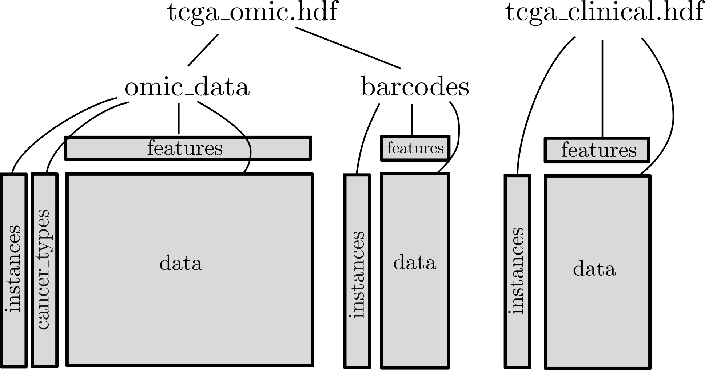

# tcga-pipeline
Downloads TCGA data from the Broad Institute's GDAC Firehose pipeline and stores it in convenient HDF files.

We've already done the hard work! Feel free to **download the HDF files directly from Zenodo:**

https://doi.org/10.5281/zenodo.4434748

* `tcga_omic.tar.gz`: multi-omic data (1.6GB)
* `tcga_clinical.tar.gz`: clinical annotations (6.2MB)

## The Cancer Genome Atlas ([TCGA](https://www.cancer.gov/about-nci/organization/ccg/research/structural-genomics/tcga))

* TCGA includes multi-omic and clinical data, collected from 11,000+ patients divided into 38 cancer types.
* It is a really compelling dataset for supervised or unsupervised machine learning tasks.
* You can access TCGA data via [FireBrowse](http://firebrowse.org/) or the [`firehose_get`](https://broadinstitute.atlassian.net/wiki/spaces/GDAC/pages/844333139/Download) command line tool.
* Unfortunately, these tools (FireBrowse/Firehose) are inconvenient for the uninitiated. 
    - Unless you have a lot of bioinformatics background knowledge, it can be difficult to understand which data you should actually download.
    - Once you've downloaded the data, it exists as several GB of zipped text files with long, complicated names.

This repository contains a complete workflow for (i) downloading useful kinds of TCGA data and (ii) storing it in a sensible format -- an HDF file.

## Setup and execution

If you really want to run the code in this repo for yourself, then take the following steps:

1. Clone the repository: `git clone git@github.com:dpmerrell/tcga-pipeline`.
2. Set up your python environment. Install the dependencies: `pip install -r requirements.txt`.
   (I recommend doing this in a virtual environment.)
3. Make sure you have plenty of disk space. The downloaded, unzipped, and partially processed data will take a footprint of **280GB on disk**.
4. Make sure you have plenty of time. The downloads take a while -- consider running it overnight.
5. If you're feeling brave, adjust the parameters in the `config.yaml` file.
6. Run the Snakemake workflow: `snakemake --cores 1`. Using more cores doesn't necessarily buy you any speed for downloading data.

## Structure of the data

### Multi-omic data 

This workflow produces an HDF file of multi-omic data, with the structure illustrated above.

* `/omic_data`. HDF5 group containing multi-omic data, along with row and column information.
* `/barcodes`. HDF5 group containing full TCGA barcodes for data samples. I.e., it gives the barcode for each sample and and each omic type (when it exists). Full barcodes are potentially useful for modeling batch effects. 

Omic data feature names take the following form:

`GENE_DATATYPE`

Possible values for `DATATYPE` include `mutation`, `cnv`, `methylation`, `mrnaseq`, and `rppa`.
 
There are many missing values, indicated by `NaN`s -- not all measurements were taken for all patients.

### Clinical data

This workflow also produces an HDF file of clinical data. 
Its structure is also shown in the figure.

## Some provenance details

We download data from particular points in the [Broad Intitute GDAC Firehose pipeline](https://broadinstitute.atlassian.net/wiki/spaces/GDAC/pages/844333681/Rationale). 

* Copy number variation
    - `CopyNumber_Gistic2` node in [this DAG](http://gdac.broadinstitute.org/Analyses-DAG.html)
* Somatic Mutation annotations
    - `Mutation_Packager_Oncotated_Calls` node in [this dag](http://gdac.broadinstitute.org/stddata-DAG.html)
* Methylation
    - `Methylation_Preprocess` node in [this DAG](http://gdac.broadinstitute.org/stddata-DAG.html)
    - We recover the barcodes for methylation samples by inspecting the corresponding entries in "humanmethylation450" files whenever they exist, and "humanmethylation27" thereafter.
* Gene expression
    - `mRNAseq_Preprocess` node in [this DAG](http://gdac.broadinstitute.org/stddata-DAG.html)
    - We recover the barcodes for RNAseq samples by inspecting the corresponding entries in "illuminahiseq" files whenever they exist, and "illuminaga" thereafter.
* Reverse Phase Protein Array
    - `RPPA_AnnotateWithGene` node in [this DAG](http://gdac.broadinstitute.org/stddata-DAG.html)
* Clinical Data
    - `Clinical_Pick_Tier1` node in [this DAG](http://gdac.broadinstitute.org/stddata-DAG.html)

## Licensing/Legal stuff

(c) David Merrell 2021

The software in this repository is distributed under an MIT license. See `LICENSE.txt` for details.

Note: downloading data from the BROAD TCGA GDAC site constitutes agreement to the TCGA Data Usage Policy: 

https://broadinstitute.atlassian.net/wiki/spaces/GDAC/pages/844333156/Data+Usage+Policy

See also this note from the NIH: https://www.cancer.gov/about-nci/organization/ccg/research/structural-genomics/tcga/using-tcga/citing-tcga

* Guidelines for citing TCGA in your research
* data usage in publications: *...all TCGA data are available without restrictions on their use in publications or presentations.*
